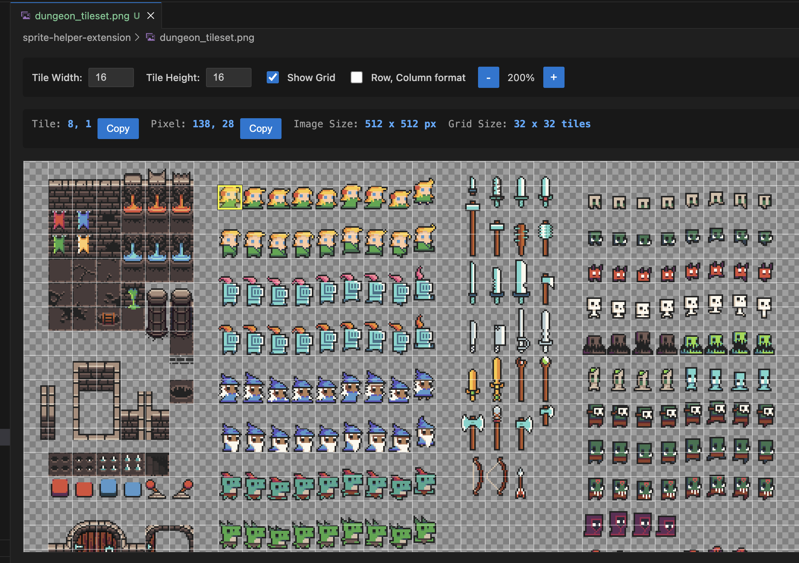

# Saint Carlo Sprite Viewer

A VSCode extension for game developers and pixel artists to inspect sprite sheets. Click on any tile to see its coordinates, toggle a grid overlay, and copy coordinates to your clipboard.



## Features

- **Tile Coordinate Display** - Click any tile to see its grid coordinates (column, row)
- **Pixel Position** - Also shows the exact pixel coordinates of your click
- **Grid Overlay** - Toggle a grid overlay to visualize tile boundaries
- **Coordinate Format Toggle** - Switch between (column, row) and (row, column) format
- **Copy to Clipboard** - Quickly copy tile or pixel coordinates
- **Zoom Controls** - Zoom from 25% to 800% for detailed inspection
- **Image Info** - Shows image dimensions and total grid size

## Usage

1. Right-click any `.png` file in the VSCode Explorer
2. Select **"Open with Saint Carlo Sprite Viewer"**
3. Set your tile width and height at the top (e.g., 16x16)
4. Click on any tile to select it and see its coordinates

## Installation

### From Open VSX

Search for "Saint Carlo Sprite Viewer" in the Extensions view or visit the [Open VSX listing](https://open-vsx.org/extension/csharp-forge/saint-carlo-sprite-viewer).

### From Source

```bash
git clone https://github.com/JohnVonDrashek/saint-carlo-sprite-viewer.git
cd saint-carlo-sprite-viewer
npm install
npm run compile
```

Then press `F5` in VSCode to launch the Extension Development Host.

## License

MIT - see [LICENSE](LICENSE) for details.
